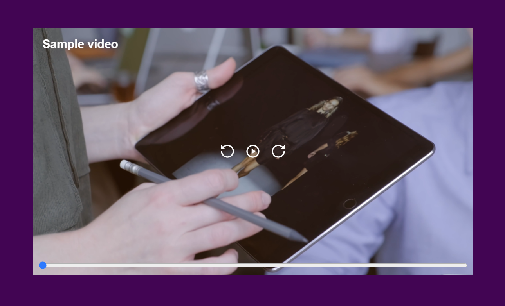

# Video Player
> Video-Player made from scratch with HTML, CSS and JavaScript. It's an excercise of the course Introduction to Web Development.
> Live demo [_here_](https://frankovg.github.io/video-player/).

## Table of Contents
* [General Info](#general-information)
* [Technologies Used](#technologies-used)
* [Features](#features)
* [Screenshots](#screenshots)
* [Acknowledgements](#acknowledgements)
* [Contact](#contact)

## General Information
- The Video Player is an excercise for learning Vanilla Javascript.
- All the functionalities are made with JS.

## Technologies Used
- JavaScript
- HTML5
- CSS3

## Features
List the ready features here:
- It detects the duration of the video automatically.
- You can go forward or backward 5 seconds (because the example video is too short, but it can be changed to 10 seconds).
- Play and pause.
- The timebar can be changed by clicking on it.

## Screenshots

<!-- If you have screenshots you'd like to share, include them here. -->

## Acknowledgements
- This project was based on [Leonidas Esteban](https://leonidasesteban.com/) tutorial.

## Contact
Created by [Franco Amoroso](https://www.linkedin.com/in/francoamoroso/)) - feel free to contact me!
